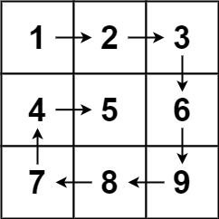

## [LeetCode 54. Spiral Matrix](https://leetcode.com/problems/spiral-matrix/)

---

> Given an m x n matrix, return all elements of the matrix in spiral order. <br>
> 

#### Solution
```java
class Solution {
    public List<Integer> spiralOrder(int[][] matrix) {
        int rows = matrix.length;
        int cols = matrix[0].length;
        List<Integer> res = new ArrayList<>();

        // boundary
        int up = 0, left = 0, down = rows - 1, right = cols - 1;

        while (res.size() < rows * cols) {
            // left to right
            for (int col = left; col <= right; col++) {
                res.add(matrix[up][col]);
            }
            // right top to right bottom
            for (int row = up + 1; row <= down; row++) {
                res.add(matrix[row][right]);
            }
            // top and bottom are in different rows
            if (up != down) {
                // right bottom to left bottom
                for (int col = right - 1; col >= left; col--) {
                    res.add(matrix[down][col]);
                }
            }
            // left and right are in different rows
            if (left != right) {
                // left bottom to left top
                for (int row = down - 1; row > up; row--) {
                    res.add(matrix[row][left]);
                }
            }
            left++;
            right--;
            up++;
            down--;
        }

        return res;
    }
}
```
