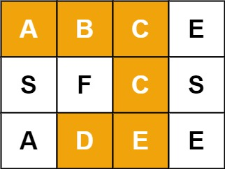

## [79. Word Search](https://leetcode.com/problems/word-search/)

---

> Given an m x n grid of characters board and a string word, return true if word exists in the grid. 
> The word can be constructed from letters of sequentially adjacent cells, 
> where adjacent cells are horizontally or vertically neighboring. The same letter cell may not be used more than once.
> 
> <b>Example</b> <br>
>  <br>
> Input: board = [["A","B","C","E"],["S","F","C","S"],["A","D","E","E"]], word = "ABCCED" <br>
> Output: true

```java
class Solution {
    char[][] board;
    int rows;
    int cols;

    public boolean exist(char[][] board, String word) {
        this.board = board;
        this.rows = board.length;
        this.cols = board[0].length;

        int[] fb = new int['Z' - 'A' + 1];
        int[] fw = new int['Z' - 'A' + 1];
        // count number of character appearance in board
        for (int row = 0; row < this.rows; row++) {
            for (int col = 0; col < this.cols; col++) {
                fb[Character.toUpperCase(board[row][col]) - 'A']++;
            }
        }
        // count number of character appearance in word
        for (char l : word.toCharArray()) {
            l = Character.toUpperCase(l);
            fw[l - 'A']++;
        }

        // prune case: not enough letter in the board
        for (char l : word.toCharArray()) {
            l = Character.toUpperCase(l);

            if (fw[l - 'A'] > fb[l - 'A'])
                return false;
        }

        for (int row = 0; row < this.rows; row++) {
            for (int col = 0; col < this.cols; col++) {
                if (traverse(row, col, word, 0))
                    return true;
            }
        }

        return false;
    }

    boolean traverse(int row, int col, String word, int idx) {
        if (idx >= word.length()) return true;

        if (row < 0 || row == this.rows || col < 0 || col == this.cols
                || this.board[row][col] != word.charAt(idx))
            return false;

        this.board[row][col] = '#';

        int[] rowOffsets = {0, 1, 0, -1};
        int[] colOffsets = {1, 0, -1, 0};
        for (int i = 0; i < 4; i++) {
            if (traverse(row + rowOffsets[i], col + colOffsets[i], word, idx + 1)) {
                return true;
            }
        }

        this.board[row][col] = word.charAt(idx);
        return false;

    }
}
```