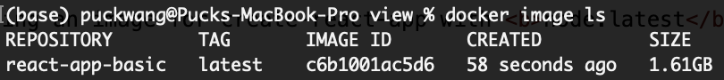

# Docker Image
> command: docker build -t docker-image-name .

Benefit of using Dockerfile:
- Full control of environment dependencies and workflow of the image building process.
- Maximized image optimization in terms of building time and space.
- Image version control.

Cons of using Dockerfile:
- Not really... 

Although disk space may be abundant on local development environment, when a web application is deployed to production environment, disk space and memory become scarce  as databases and micro-services may require additional resources.

### Example 1: Building an image for create-react-app with <b>node:14</b>
```Dockerfile
FROM node:14
WORKDIR /app
COPY package.json /app
RUN yarn
COPY . .
EXPOSE 3000
CMD [ "yarn", "start" ]
```

The 1.61GB image is composed of the latest node.js source code, node_modules and source code. NOTE: production environment does not need source code to run, so the image still has room to optimize.

### Example 2: Building an image for create-react-app with <b>node:14-alphine</b>
```Dockerfile
FROM node:14-alpine
WORKDIR /app
COPY package.json /app
RUN yarn
COPY . .
EXPOSE 3000
CMD [ "yarn", "start" ] 
```
Alpine Linux is much smaller than most distribution base images (~5MB), and thus leads to much slimmer images in general.(https://hub.docker.com/_/node)

So far, we have used a smaller version of node image to free up more than 50% disk space on built image. However, 731MB is still too large for a simple react image.

### Example 3: Building an image for create-react-app with <b>node:14-alpine + nginx</b>

```Dockerfile
FROM node:14.17-alpine as react_build 

WORKDIR /app
#copy the react app to the container
COPY ["package.json", "./"]
RUN ["yarn"]
COPY . /app/ 

# #prepare the contiainer for building react 
RUN npm run build 

#prepare nginx
FROM nginx:1.16.0-alpine

COPY --from=react_build /app/build /usr/share/nginx/html
RUN rm /etc/nginx/conf.d/default.conf
COPY nginx/nginx.conf /etc/nginx/conf.d

#fire up nginx
EXPOSE 80 
CMD ["nginx","-g","daemon off;"]
```

```nginx
<!-- nginx.conf -->

server {

  listen 80;
  
  location / {
    root   /usr/share/nginx/html;
    index  index.html index.htm;
    try_files $uri $uri/ /index.html;

     #proxy_pass http://192.168.151.107:3030/;
  }

  error_page   500 502 503 504  /50x.html;

  location = /50x.html {
    root   /usr/share/nginx/html;
  }
}

upstream backend {

  # nginx as a load balancer with proxy
  ip_hash;
  server 192.168.0.1:31300 weight=5;
  server 192.168.0.1:31301 weight=1;
  server 192.168.0.1:31302 max_fails=3 fail_timeout=30s weight=1;

}

proxy_cache_path /etc/nginx/cache keys_zone=my_cache:10m max_size=100m inactive=60m use_temp_path=off;
# nginx as a reverse proxy
# this will route our frontend requests to the backend on port 4008
server {
  listen 9090;

  location / {
        proxy_cache my_cache;
        proxy_cache_valid 200 30s;
        proxy_cache_methods GET HEAD POST;
        proxy_cache_min_uses 1;
        proxy_cache_use_stale error timeout http_500 http_502 http_503 http_504;
        # proxy_pass http://backend;
        proxy_redirect     off;
        proxy_set_header   Host $host;
        proxy_set_header   X-Real-IP $remote_addr;
        proxy_set_header   X-Forwarded-For $proxy_add_x_forwarded_for;
        proxy_set_header   X-Forwarded-Host $server_name;
  }
}
```

In this example, we move the react build code to nginx server, and build the nginx server image instead, which results at 27.3MB. 